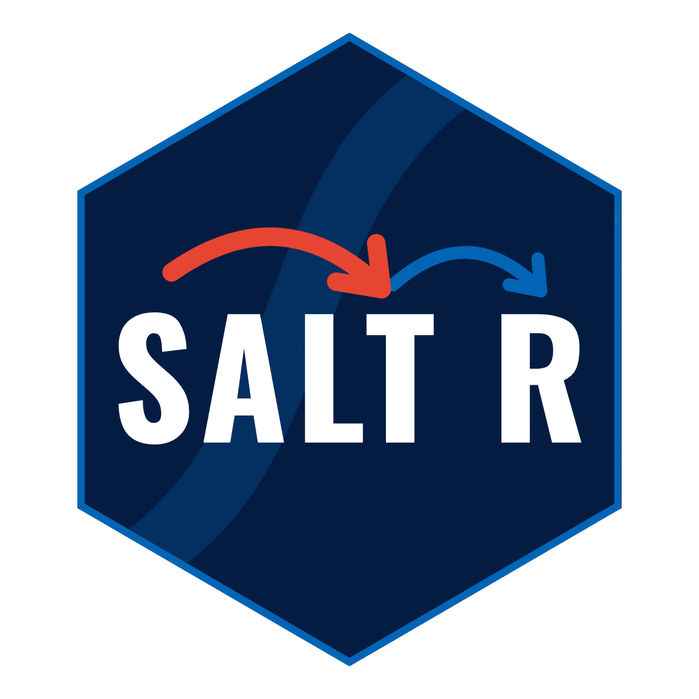

<!-- README.md is generated from README.Rmd. Please edit that file -->
<!-- pkgdown::build_site()  -->
<!-- devtools::build_readme() -->
<!-- badges: start -->
[](https://github.com/beltranpantoja/saltR/actions/workflows/R-CMD-check.yaml)
<!-- badges: end -->

```{r, include = FALSE}
knitr::opts_chunk$set(
  collapse = TRUE,
  comment = "#>",
  fig.path = "man/figures/README-",
  out.width = "100%"
)
```

# saltr <a href="https://beltranpantoja.github.io/saltR/"></a>

The goal of _saltr_ (pronounced _salt-er_, like the word jump in Spanish), is to
help create readable simulations through the use of semantically meaningful functions. that allow researchers to use it in a flexible way without needing to commit fully to the package.

### How is this library different? 

A lot of the statistics libraries make heavy use of objects. This allows packages
to handle things neatly and avoid errors that can be hard to debug on the user side. The downside is, however, that this closed systems are stiff black boxes, most of the time require a lot of custom code and have a steeper learning curve. 

Saltr is a library that aims to give researchers, in the DCM field, the tools they need to jump start their simulations by making it easier to work with matrices and the gdina objects from the [CDM package](https://cran.r-project.org/web/packages/CDM/index.html). Saltr has been designed following the [tidyverse style guide](https://style.tidyverse.org/functions.html) so all functions are actions that are designed to work nicely with the pipe operator `|>`.  Additionally, 
functions try and implement meaningful `warning` and `error` messages that help 
fix bugs during the coding process.

## Core functions

Saltr is built around 5 function families identified by their suffix: `create_*`,
`build_*`, `generate_*`, `get_*`,  and `change_*`.

The `create_*` functions are mostly utility functions. They take some simple 
arguments and help create useful objects. For example, `create_qmatrix` makes it
faster to create a starting Q-matrix that can be then modified. 

The `build_*` functions always take as an input some matrix and return an object
that is related. For example, we can create a test that is consistent with a 
Q-matrix by calling `build_test_parameters`. These functions can also be useful
to build theoretical results like `build_response_likelihood`.

The `generate_*` functions are the only group that is not deterministic, hence 
the name. These functions are the bread and butter of a simulation study. We use
these to create random samples of examinees (`generate_examinees`) and their responses (`generate_responses`).

So far all these families of functions are package agnostic, but in a simulation
there will be a moment where we will want to fit a DCM model and extract some 
information. Some information is readily available, but other can be more 
cumbersome and require extra wrangling. The `get_*` functions simplify the 
extraction of information from the model.

Finally, the `change_*` family takes and object and returns a modified version 
of it. Useful for changes to objects that are relevant for a study like 
`change_qmatrix` and `change_test_parameters` that simplify studying, for example,
misspecification of a model. 


## Get Started

You can install saltr from [GitHub](https://github.com/beltranpantoja/saltR) with:

``` r
devtools::install_github("beltranpantoja/saltR")
```

And then jump to [Creating a single simulation](vignettes/run_simulation) tutorial 
